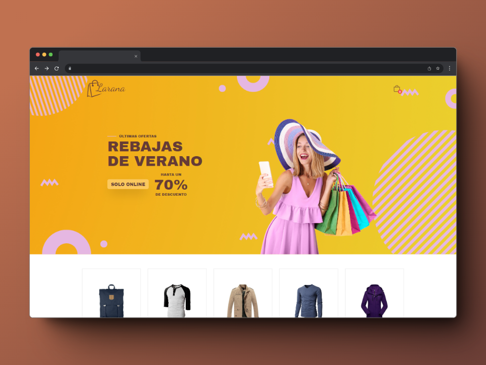
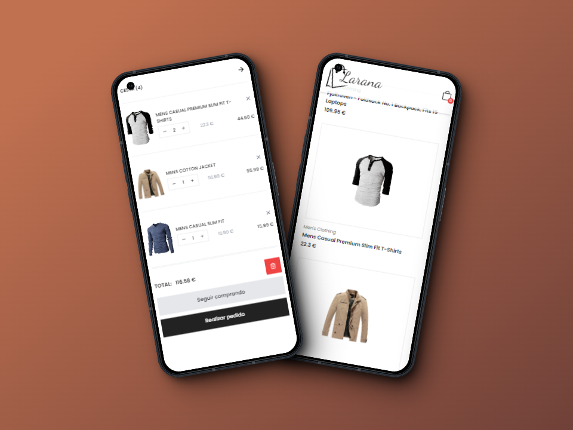

<a name="readme-top"></a>


<div align="center">

<a href="">
  
</a>

# Larana Ecommerce

Este proyecto se centra en el desarrollo del frontend de un ecommerce, proporcionando una interfaz de usuario intuitiva y atractiva para los clientes. A continuación, se detallan algunos aspectos clave del proyecto.\
[Reportar error](https://github.com/FlorPManzano/ecommerce-shop/issues) · [Sugerir algo](https://github.com/FlorPManzano/ecommerce-shop/issues)

</div>

<details>
<summary>Tabla de contenidos</summary>

- [Características principales](#características-principales)
  - [Capturas de pantalla del ecommerce](#capturas-de-pantalla)
  - [Demo ecommerce](#demo)
- [Instalación](#instalación)
- [Mejoras](#mejoras)
- [Teconologías](#teconologías)
- [Enlaces de interés](#enlaces-de-interés)
</details>

## Características principales

- **Detalles de los productos**: obtén información detallada sobre precios o descripción de los artículos.
- **Añade productos a la cesta**: permite a los usuarios agregar o eliminar artículos del carrito de compras. Posibilidad de editar la cantidad de cada artículo.
- **Diseño responsive**: adaptando la apariencia de la página web al dispositivo que se esté utilizando para visitarlas.

### Capturas de pantalla




<p align="right">(<a href="#readme-top">volver arriba</a>)</p>

### Demo

Echa un vistazo a todas las funcionalidades del proyecto a partir del siguiente video:

[Ver demo](https://www.loom.com/share/d05e5c88e04443cda3b8a9d6fa091dcb?sid=60647f93-6916-47a3-be71-7f77c99af02f)

<p align="right">(<a href="#readme-top">volver arriba</a>)</p>

## Instalación

Clona el repositorio

```bash
  git clone https://github.com/FlorPManzano/ecommerce-shop
```

Entra a la carpeta del repositorio

```bash
  cd ecommerce-shop
```

Instala las dependencias

```bash
  npm install
```

Ejecuta el proyecto

```bash
  npm run dev
```

<p align="right">(<a href="#readme-top">volver arriba</a>)</p>

## Mejoras

- Añadir API
- Crear una plataforma de pago

<p align="right">(<a href="#readme-top">volver arriba</a>)</p>

## Teconologías

-  - La biblioteca para interfaces de usuario web y nativas

-  - Framework de CSS para crear sitios web rápidamente.

-  - Herramientas para crear entornos de desarrollo

-  - Encuentra y soluciona problemas en tu código JavaScript

<p align="right">(<a href="#readme-top">volver arriba</a>)</p>

## Enlaces de interés

Si quieres saber más sobre mí, te dejo los enlaces a mis redes sociales:

[](https://www.linkedin.com/in/florpmanzano/)
[](https://portfolio-florpmanzano.vercel.app/)

<p align="right">(<a href="#readme-top">volver arriba</a>)</p>
